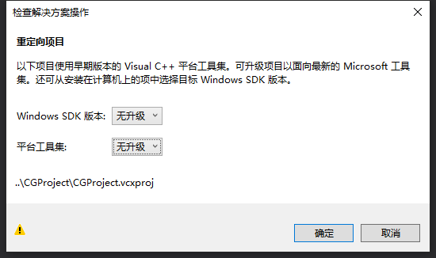
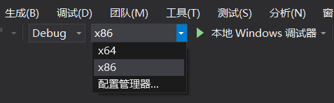

# CGProject

> A computer graphics project
>
> 所用库版本清单：
>
> * ImGui v1.68
> * glm-0.9.9.5
> * assimp-4.1.0
>

## 单个目标物体（光照、贴图、阴影一条龙）邵梓硕

- 添加了一个目标物体，运用了Phong光照、贴图、阴影，可以自定义很多东西（没有碰撞检测，但返回的位置信息之后应该有用）

### 文件变动

- 新增类
  - `Target`类，目标物体类
  - `TargetManager`类：如果要管理多个目标时可以利用这个类，可以参考类似的`BulletManager`类，由于碰到了蜜汁错误，在现在的项目里实际上并没有用到。

- 修改文件：main.cpp
  1. 去除nanosuit模型的加载部分。
  2. 注释掉场景的加载部分。
  3. 增加目标物体的初始化和加载。

- 修改文件：Controler类

  1. 增加变量：比如光源位置、阴影和光照需要的3个Shader、depthMap等

  2. 增加函数：

     loadDepthMap：加载depthMap和depthMapFBO。

     loadTexture：返回加载的贴图ID，传入贴图路径。**这个是static方法，可以在其他类中直接引用**

  3. 修改函数：

     init：增加新增变量的初始化部分。

- 新增文件

  - GLSL
    - quad_depth.fs
    - quad_depth.vs
    - shadow_mapping.fs
    - shadow_mapping.vs
    - simpleDepthShader.fs
    - simpleDepthShader.vs

  - resources
    - picture
      - pic.png

### Target类的使用

#### 1. 位置的自定义

在main.cpp中初始化目标物体的位置和目标物体和光源的相对位置，相对位置的设置是为了更适合的阴影效果，二者都可以进行自定义：

``` c++
//target position
glm::vec3 targetPos = glm::vec3(5.0f, 0.0f, 0.0f);
//light position relative to target
glm::vec3 relativePos = glm::vec3(0.0f, 7.0f, -2.0f);

//light position
glm::vec3 Controler::lightPos = targetPos + relativePos;
```

#### 2. 贴图的自定义

在Target类的InitialData中进行初始化时：

``` c++
//可以修改贴图路径
myTexture = Controler::loadTexture("resources/picture/pic.png");
```

#### 3. 光照参数的自定义

在Target类的InitialData中进行初始化时：

``` c++
ambientStrength = 1.0f;
specularStrength = 1.0f;
diffuseStrength = 1.0f;
specN = 32;
```

#### 4. 实例化加载

Target的初始化：

``` c++
Target *target = new Target(targetPos);
```

在渲染循环中：

``` c++
target->render(projection, view);
```

**注意：**由于render方法中有很多影响全局的gl操作，注意这个render在循环渲染中的位置，改动的话有可能其他素材无法正常加载。

---


## 射击操作 ljh

- 添加鼠标点击事件监听，左键点击时触发子弹发射
- 通过 `BulletManager` 维护子弹的生成、渲染、销毁
- 当子弹离玩家角色超过一定距离时，销毁子弹实例 (目前还没碰撞检测)

### 文件变动

- 类
  - `BulletManager` 类，挂载在 `Controller` 之下，内部有一个 vector<Bullet> 维护子弹队列
  - `Bullet` 类，用于管理和渲染子弹，目前缺少模型，只是用简单的 cube 展示

---


## Camera Roaming 李杰泓

- 添加单实例 Player 类，`controller` 监听鼠标、键盘事件分发给 `Player` 而不再是 `Camera`
- Camera 绑定到 Player 上，通过 `Player` 更新 `Camera` 位置，并且视角转动时改变 
  Player 自身朝向，与 `Camera` 的 `yaw` 同步
- Camera yaw 属性添加视角范围限制
- `WASD` 控制移动时只取 `front` 向量投影到xoz平面的分量，保证高度位置不变 
- 按住 `left-Ctrl` 支持上帝视角
- 修复 `.h` 头文件循环include 问题

### 文件变动

- 修改 controller、Camera 等相关文件
- 删除了一些没用的文件
- 类
  - `Player` 类，作为 `Controller` 下单实例存在
  - `Bullet` 类，用于管理和渲染子弹，目前缺少模型，只是用简单的 cube 展示

---


## 模型导入 by wuzht

> ⚠️ Assimp 已经配置好，无需再配置。[这里](./配置Assimp.md) 总结了配置方法。
>
> ⚠️ 运行前要复制一个 dll 文件，请阅读 [运行方法](#运行方法)

### 文件变动

* 添加了 `CG_stb_image.h` ，当您想使用 `stb_image.h`，就 `#include "CG_stb_image.h"`，解决 `stb_image.h` 重复包含的问题。

* 类

  * `Mesh` 类，被 `Model` 类调用。

    通过使用 Assimp，我们可以加载不同的模型到程序中，但是载入后它们都被储存为 Assimp 的数据结构。使用 `Mesh` 类可以将这些数据转换为 OpenGL 能够理解的格式。

  * `Model` 类

    使用 Assimp 来加载模型，并将它转换 (Translate) 至多个 `Mesh` 对象，得到完整的 `Model` 对象。

    使用 IDE 的 Debug 模式下加载模型会非常缓慢，所以在你遇到缓慢的加载速度时，可以试试使用Release 模式。

  * `CGModel` 类，继承 `Model` 类

    `CGModel` 类构造函数的参数列表是 模型路径、vertex shader 路径、fragment shader 路径。
    
    ⚠️ 创建一个`CGModel` 对象后，要通过 `setModelMatrix` 函数设置好模型的 `model` 矩阵 (自己调参)
    
    `render` 函数在渲染循环里调用，参数是 `projection`、`view` 矩阵

* 删除了无用的类

* 新增文件夹 `resources/model`，模型资源都放在这里

* 修改了 `main.cpp`，使用了 `ModelLoadingExample` 类渲染了一个模型。

### Model 类的使用

> 当您想添加模型时，请使用 `CGModel` 类，不要使用 `Model` 类

为模型编译好着色器，并加载模型：

```c++
// build and compile shaders for the model
Shader shader("model_loading.vs", "model_loading.fs");
// load model
Model model("resources/model/nanosuit/nanosuit.obj");
```

在渲染循环中：

```c++
// enable shader before setting uniforms
shader.use();

// TODO: set the view, projection and model matrices

// render the loaded model
model.draw(shader);
```

---


## 更新天空盒	邵梓硕

#### 文件变动：

- 新增文件夹`resources`

  资源文件夹，目前只有skybox，已经预备了四个天空盒来使用，之后的模型资源都可以放到这个文件夹中。

- 新增类

  SkyBox.h：天空盒头文件。

  SkyBox.cpp：天空盒源文件。

- 修改

  修改main文件，加入天空盒操作，去除了贝塞尔曲线部分。

#### 天空盒的使用

**有的天空盒底部根本没有图片，因此摄像机的仰角俯角最好限制在一定角度之间，这部分交给Camera Roaming的同学。**

1. 在main.cpp文件中include天空盒头文件。

2. 初始化天空盒，确定要使用哪个天空盒：

   ``` c++
   //skybox, 这里使用的是envmap_miramar天空盒
   SkyBox skybox("envmap_miramar");
   ```

3. 在主循环中调用skybox.render()函数，参数是摄像机：

   ``` c++
   //注意这步不能缺
   glDepthFunc(GL_LEQUAL);
   //render
   skybox.render(Controler::getInstance()->camera);
   ```

---

## 运行方法

> 运行前，请确认已安装：
>
> - Windows SDK 版本：10.0.177.63.0
> - 平台工具集：Visual Studio 2017 (v141)

步骤：

1. 打开命令行，将项目克隆到本地

   ```sh
   git clone https://github.com/sysu-computer-graphics/CGProject.git
   ```

2. 打开 `CGProject.sln`

   如果出现以下窗口，`Windows SDK 版本` 和 `平台工具集` 都选择 `无升级`

   

3. 选择 x86

   

4. 将 `Libs` 文件夹中的 `assimp-vc140-mt.dll` 复制到您 OpenGL 工程中可执行文件的同一目录下，即复制到 `Debug` 文件夹中 (如果您是 Release 模式，则复制到 `Release` 文件夹中)。

   如果这个文件夹不存在 (您刚刚 clone 了本仓库时)，您可以先点击运行项目，然后这个文件夹就出现了，并且会提示您找不到 `assimp-vc140-mt.dll`。

5. 运行


## 文件结构

文件夹

* `Includes`

  存放 `GLFW, glad, glm, KHR, std_image.h, assimp` 等文件

* `Libs`

  存放 `glfw3.lib, assimp-vc140-mt.lib, assimp-vc140-mt.dll`

* `ImGui`

  ImGui 的代码

* `GLSL`

  存放着色器代码
  
* `resources`

  * `model` 存放模型
  * `skybox` 存放天空盒

文件

* 已经写好 `Camera`，`Shader` 类
* `Controler` 类是控制器类，初始化 GLFW 以及绑定各种回调函数，定义回调函数的行为等
* 渲染循环在 `main.cpp` 里


## References

OpenGL 环境配置参考：[【PT君的OpenGL】第一天【VS2017+OpenGL环境的配置(固定管线+可编程管线)】](https://blog.csdn.net/qq_19003345/article/details/76098781)

