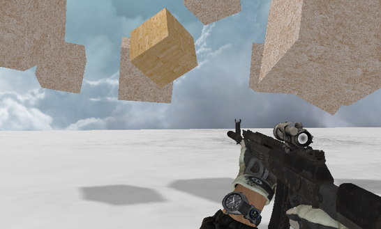
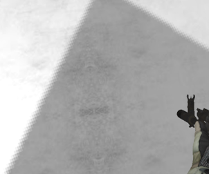
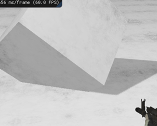
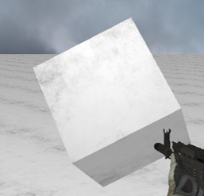
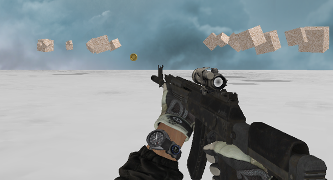
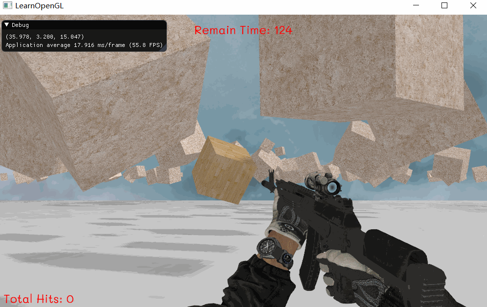
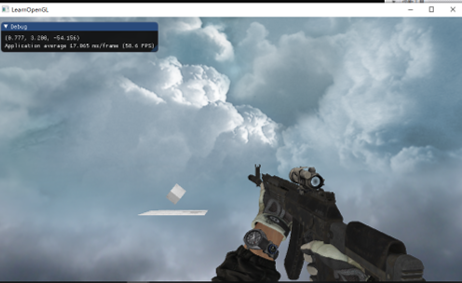
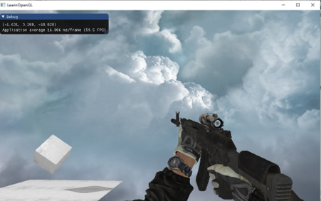
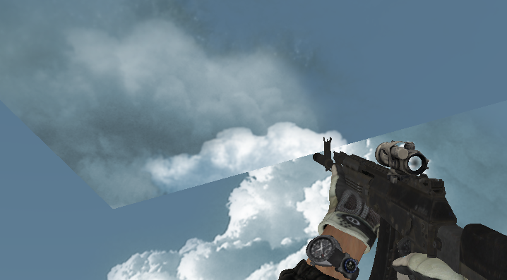
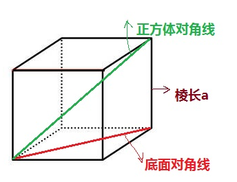

# 项目报告

## 项目介绍

实现的项目为第一人称单人射击游戏，目标为在一定时间内避开障碍物，射击更多目标物体。基本规则如下：

- 玩家通过WSAD和空格控制角色的移动与跳跃，鼠标左键射击，鼠标的移动控制视角的转动。
- 目标物体与障碍物的贴图不同。集中目标物体左下角分数+1，累计每击中3次障碍物左下角分数-1，没有负分。
- 时间限制在窗口上方，时间为0时游戏结束。
- 角色移动范围控制在游戏区域内，无法移动至区域外。

**实现结果**

见同目录下的演示视频。

## 开发环境

- 环境：Windows
- 工具：Visual Studio
- 第三方库：assimp、glfw3、freetype

## 实现功能

| 功能                                                        | 实现部分                                   | 类型  |
| ----------------------------------------------------------- | ------------------------------------------ | ----- |
| Camera Roaming                                              | 玩家视角摄像机                             | Basic |
| Simple lighting and shading(phong)                          | 地面、目标物体、障碍物的光照               | Basic |
| Texture mapping                                             | 地面、目标物体、障碍物、子弹的贴图         | Basic |
| Shadow mapping                                              | 目标物体、障碍物的阴影                     | Basic |
| Model import & Mesh viewing (Assimp)                        | AK（附手臂）的模型加载                     | Basic |
| Sky Box (天空盒)                                            | 天空盒                                     | Bonus |
| Display Text (显示文字，中文/英文/立体/平面)                | 分数，倒计时                               | Bonus |
| Gravity System and Collision Detection (重力系统与碰撞检测) | 跳跃功能，子弹与物体的碰撞检测             | Bonus |
| Anti-Aliasing (抗锯齿)                                      | 阴影的抗锯齿                               | Bonus |
| Gamma矫正                                                   | 阴影的Gamma矫正                            | Bonus |
| 射击                                                        | 包括子弹的产生、调整、运动、消失，点击响应 | Bonus |

## 对实现功能的简单介绍

### Basic

#### 摄像机 Camera Roaming

按照 FPS 游戏的方法，使得玩家在场景中的正常移动

#### 贴图  Texture mapping 

由于场景中并无需要法线贴图的部分，这里采用普通的光照贴图，且目标，地面、子弹和障碍物采用不同的贴图，只需在每次渲染对应部分前激活对应的贴图。

其中目标物体为木板贴图，障碍物和子弹为粗糙贴图，地面为大理石贴图，效果如下：



#### 阴影 Shadow mapping 

**实现**：对目标物体进行阴影映射，并对基本阴影映射进行优化：去除线条样式的阴影失真、去除悬浮（由于目标物体本身悬浮效果不明显）、PCF。

其中，线条样式的阴影失真通过阴影偏移来解决，对表面的深度应用一个偏移量，使得采样点都获得比表面深度都小的深度值。效果见上面的图。

去除悬浮是通过正面剔除（glCullFace(GL_FRONT)），效果见下图

PCF的他一个简单实现是从纹理像素的四周进行多次采样，把结果平均起来得到最终的像素值，这也是抗锯齿的原理，效果见下图。

 

#### 光照 Simple lighting（Phong）

光照采用Blinn-Phong光照，并增加gamma矫正，gamma值设定为2.2。各个参数在场景初始化中设定。在本次项目中光源位置和光源视角的设置比较麻烦。



#### 模型加载 Model import & Mesh viewing

模型加载部分主要用到了 Assimp 库。寻找了枪、手、子弹等模型，使用三维模型处理软件 (Blender) 处理模型，并实现加载和渲染。Assimp 库能支持三维模型的多种文件类型，其中枪和手的模型是使用 Blender 处理后导出的 obj 文件，子弹模型的文件格式是 gltf。在这部分，我们创建了两个主要的类，分别是 `Mesh` 和 `Model` 类。

总体效果图如下：



通过使用 Assimp，我们可以加载不同的模型到程序中，但是载入后它们都被储存为 Assimp 的数据结构。使用 `Mesh` 类可以将这些数据转换为 OpenGL 能够理解的格式。然后使用 Assimp 来加载模型，并将它转换 (Translate) 至多个 `Mesh` 对象，得到完整的 `Model` 对象。

我们使用枪和手的模型作为玩家 (Player)，因为这个游戏是一款第一人称单人射击游戏，所以玩家的视野就看到手和枪了，于是我们让这个模型跟随着 Camera 来移动，而 Camera 看到的东西就是玩家所看到的东西。

对于子弹模型，它原本的自身朝向是不变的，如果不进行相应的旋转，就会出现很奇怪的画面，比如子弹横着被射出，这显然不是我们想要的。于是在玩家点击射击后，子弹生成 (子弹由子弹管理器类生成和管理) 时，首先根据 Camera 的 pitch 和 yaw 进行旋转，使得子弹射出后自身朝向前方，然后再射出子弹。

### Bonus

#### 重力系统 Gravity System

玩家的按空格键模拟重力跳起和下落。效果如下：


实现方法如下：

在 `Controller` 类里设置对空格键的按键响应

```c++
if (glfwGetKey(window, GLFW_KEY_SPACE) == GLFW_PRESS && !player->isJumping) player->onSpaceKeyDownJump();
```

设定一个向下的重力加速度

```c++
const glm::vec3 gravity = glm::vec3(0.0f, -9.8f, 0.0f);
```

按下空格键后，设置一个向上的初速度，按匀变速运动的物理公式来计算玩家 (Player) 的所在高度

```c++
const float jumpInitSpeed = 10.0f;

this->jumpVelocity = glm::vec3(0.0f, 0.0f, 0.0f);
```

在玩家 (Player) 的渲染函数中，根据 `deltaTime` 来更新玩家的速度，然后更新玩家的位置。当玩家下落至地板时，跳跃事件结束。在游戏场景中，我们需要调整下面的一些参数，使得玩家的跳跃更加自然。

```c++
if (this->isJumping) {
    // 更新玩家的速度
	jumpVelocity += gravity * Controler::deltaTime * 3.0f;
    // 更新玩家的位置
	this->position += jumpVelocity * 0.04f;

    // 当玩家下落至地板时，跳跃事件结束
	// 3.2f是摄像机初始position的y值
	if (this->position.y < 3.2f) {
		this->position.y = 3.2f;
		this->isJumping = false;
	}
    // 同时更新Camera的位置
	Controler::camera.setPosition(this->position);
}
```

#### 碰撞检测 Collision Detection

子弹 (Bullet) 与目标物体 (Target) 的碰撞检测，当某一个 Bullet 与 Target 发生碰撞时，该 Bullet 消失，Target 随机改变位置。

遍历所有子弹，如果某个子弹与 Target 的距离小于目标物体的大小 (一个阈值) 时，销毁该子弹，并随机改变Target 的位置，准备进行下一次射击。



#### 射击 Shotting

鼠标左键能够沿着摄像机朝向(front)发射子弹；通过 BulletManager 管理子弹的创建、运动、销毁；

#### 天空盒  Sky Box 

添加天空盒，准备多个天空盒资源。天空和运用了多面体的贴图，对一个Cube的六个面分别贴上不同的贴图来模拟天空，这里用到的方法是GL_TEXTURE_CUBE_MAP_POSITIVE_X。

天空盒要始终保持在视野的远方，不随摄像机的移动而发生远近的平移，因此需要在开始就去除viewModel矩阵中的平一部分：

``` c++
glm::mat4 view = glm::mat4(glm::mat3(camera.getViewMatrix()))
```

上述代码在glm::mat3时去除了矩阵的平移部分。实现效果：






## 遇到的问题和解决方案

### Assimp 配置

在这个项目中，我们使用 Assimp 库来加载模型。然而，对于初次使用者来说，配置 Assimp 库并不是一件简单的事！我们在 [这里](../配置Assimp.md) 总结了 Assimp 的配置方法以及过程中遇到的困难与解决方案。

### 正交投影矩阵

在实验中我们采用的光源的投影矩阵是正交矩阵。在实现过程中曾经出现过一些问题：

- 在一定距离之外的物体没有渲染出来，只有走近之后才会被渲染。
- 有的物体没有阴影在地板上。

**解决方案**

第一次只发现了第二个现象，因此会猜测是不是阴影贴图部分的代码写错了，结果对照教程修改也没有发现什么错误，直到发现了第一个现象，原因就很明显了：是视野投影矩阵的问题。

在项目中我们采用的是正交矩阵来作为光源的：

```c++
//ScenceController.cpp
GLfloat near_plane = 0.1f, far_plane = 200.0f;
glm::mat4 lightProjection = glm::mat4(1.0f);
lightProjection = glm::ortho(-70.0f, 70.0f, -70.0f, 70.0f, near_plane, far_plane);
```

关于没有阴影，有两种情况出现：一个是光源太高，高于far_plane导致没有在渲染空间中，一个是投影角度太大导致阴影超出了地面范围。不管是哪个其实都是投影矩阵的参数问题，因此解决方法其实就是调节参数设置。在项目中，我尽量让光源的位置与天空盒的太阳所在的方向相契合，并且正交参数也会影响到视野，因此最终效果也不能说是两全其美，只能说是尽量满足要求。

另外，正交参数中（left, right, bottom, top）控制光源的正交投影的范围还可以控制地面上阴影的清晰度，因此需要调整到一个适合的值。

### 天空盒贴图错位

在一开始加载天空盒时出现了顶部的天空盒贴图的边缘与周围的贴图边缘错位的问题，贴图本身是完整的，但是边与边的对应关系不对：



**解决方法**

其实也没什么，结果也不是代码问题，而是图片本身的角度问题，两种方案：要么在读取图片时进行旋转，要么直接旋转图片文件，我是懒得再去写代码的人因此就只写用ACDsee软件将顶部（top）天空盒文件（.tga文件）旋转至合适的角度，这样直接读取贴图时就是正确的角度了。

### 随机大小障碍物的碰撞检测

对于碰撞检测，我们采用了最简单的距离计算的方法，如果子弹和物体位置之间的距离小于某个阈值的话，我们就认为它们相碰撞了，对于一个正方体来说，我们将阈值设为它的边长的根号3倍，因为这是正方体上的点到正方体的最大距离（最长对角线距离）。



但是障碍物在生成时边长时随机的，因此不能用一个确定的阈值来判断，否则在体验上会有很多误差。

**解决方法**

在生成障碍物时记录下每个障碍物的大小和位置，由于障碍物不会发生移动，新建和删除，因此这些信息是不会更新的，可以持续利用。由于位置与大小信息是按顺序保存的，在进行碰撞检测时可以同时检测位置和大小，根据每个碰撞五的大小进行距离检测：

``` c++
//遍历子弹
for (auto it_bullet : Controler::getInstance()->bulletManager->getBulletLists()) {
    //获取障碍物位置
    std::vector<glm::vec3> newBarrierPositions = sceneController->getBarrierNewPositions();
    std::vector<float> barrierSizes = sceneController->getBarrierSizeSet();
    //遍历障碍物
    for (int i = 0; i < newBarrierPositions.size(); i++) {
        glm::vec3 barrierPosition = newBarrierPositions[i];
        //针对每个障碍物的大小计算距离
        if (getDistance(barrierPosition, it_bullet->getPosition()) < barrierSizes[i] * PhysicsEngine::thresholdBarrierDistance) {
            Controler::getInstance()->bulletManager->deleteBullet(it_bullet->id);
            return true;
        }
    }

}
```

## 小组成员

| 姓名   | 学号     | 分工                                     | Github                            |
| ------ | -------- | ---------------------------------------- | --------------------------------- |
| 邵梓硕 | 16340189 | 天空盒、贴图映射、阴影映射、简单光照、目标物体、碰撞检测的一部分 |    [lossatsea](https://github.com/lossatsea)                               |
| 伍正涛 | 16340246 | 项目构建、配置环境、模型寻找、处理、加载，重力系统，碰撞检测 | [wuzht](https://github.com/wuzht) |
| 沈大伟 | 16340190 | 模型寻找、场景处理，复杂光照处理           | [chain](https://github.com/freesdw)   |
| 李杰泓 | 16340118 |  实现利用鼠标、键盘控制人物移动；实现子弹射击; 显示游戏信息;  | [carolsum](https://github.com/carolsum)   |


## 个人报告 —— 沈大伟

在本次项目中，我主要负责模型的寻找、场景的搭建和处理、多张纹理贴图的处理以及复杂光照的处理。

在光照模型上，我使用了Blinn-Phong光照模型，该模型也是分为环境光、漫反射和镜面反射三个部分。Phong光照模型的镜面反射由人的视角线和反射光的夹角决定，会出现高光断层现象。Blinn-Phong模型对此进行改进，通过计算半程向量，使用视角和半程向量来计算镜面反射，从而解决了高光断层现象。

在场景搭建这部分工作，历程较为曲折。最初计划是搭建一个地表形状复杂，且地表平面具有较多的遮挡物来遮挡住目标，从而使得玩家要去寻找射击的目标。为此我找了一个较为复杂的地形模型，并导入作为场景。但后来发现，因为地表凹凸不平，且遮挡物的形状都很复杂，所以碰撞检测实现难度很高，故放弃了以模型作为场景的想法。后来便以一个平面作为加上贴图作为基本场景，控制目标物体随机在一些位置上出现，同时使用带贴图的正方体作为障碍物，随机生成障碍物来增加玩家寻找目标的难度。同时，通过向量间余弦值的规律，限制玩家的活动范围在地面场景之内。

在这次项目中，我充分认识到了项目前期规划的重要性以及小组成员之间相互交流的重要性。正是因为我们前期规划只是设想了想要实现的效果，却没有想到可能遇到的技术难题以及这些难题能否解决，才导致了后面不得不重新构建场景，而曾经的设想也得不到好的实现。此外，由于小组成员之间缺乏足够的交流，项目进度较慢，导致后来更改需求后没有足够的时间再来完成更改后的设想。

## 个人报告 —— 伍正涛


## 个人报告 —— 邵梓硕

在本次项目中我负责的部分有很多是基础功能，虽然是上课的时候就讲过的内容，实际在项目中会根据需求不同，应用的场景不同，实现方式也不同，也会出现不知道怎么实现，出现各种bug的情况，因此即使是基础功能也不是一开始想的一下就能过的简单工作。从项目的初始阶段计划到最后的成品，可以说除了游戏类型之外没什么是一样的，即使一开始计划的内容很好，在制作过程中也会逐渐发现难度完全不是我们想的那么简单，加上其他课程的作业，时间也变得很紧张，最后还有学校的夏令营，就结果而言砍掉了很多内容。结果基本做好的粒子系统也是没有时间将它和项目合在一起，只能说是非常遗憾......作为计算机图形学的最后一个项目，虽然是个很简单的小游戏，但还是尽量结合了我在这个学期学习到的知识，是个很好的经验。