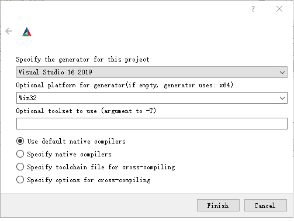
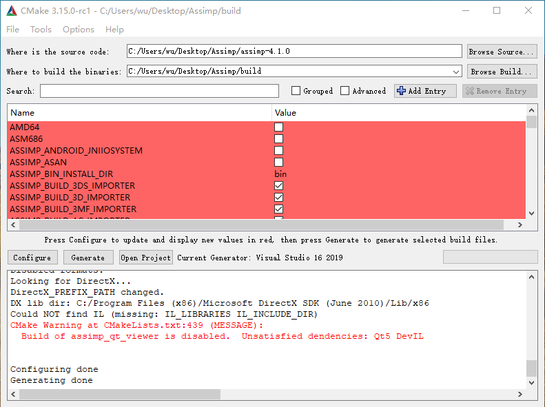

# Windows OpenGL 配置 Assimp

## 下载

* cmake-3.15.0-rc1-win64-x64.msi

  https://cmake.org/download/

* assimp-4.1.0.tar.gz

  https://github.com/assimp/assimp/releases/tag/v4.1.0/

  下载好解压，得到 `assimp-4.1.0` 文件夹

## 生成

* 创建一个文件夹 `build`，用于存放下面生成的东西

* 打开 CMake：

  * 设置：
    * Where is the source code ( `assimp-4.1.0` 文件夹的路径，如`C:/Users/wu/Desktop/Assimp/assimp-4.1.0` )
    * Where to build the binaries (刚才创建的 `build` 文件夹的路径)
    
  * 点击 Configure 
    
    
    
    * 选择 Visual Studio 版本 (选择 2017 或 2019)
    * Optional platform for generator (选择 Win32)
    * Optional toolset to use (无需改动，空着)
    * 选择 Use default native compilers (无需改动)
    * 点击 Finish
    
  * 点击 Generate

  

  完成上面操作后，在 `build` 文件夹里可以看到已经生成的 Visual Studio 解决方案

* 在 `build` 文件夹中，打开 Assimp.sln，然后在 Visual Studio 中点击 生成->生成解决方案

* 如果没有出错的话，在 `build/code/Debug` 中，可以看到两个我们所需的文件：

  * `assimp-vc140-mt.dll`
  * `assimp-vc140-mt.lib`
  
* 如果生成失败，建议换电脑或换成 Visual Studio 2019 来生成

## 配置 OpenGL 项目

> 假设：
>
> * 解决方案配置是 Debug，解决方案平台是 x86
>
> * 您的 OpenGL 的 Visual Studio 项目名为 `OpenGLProject`
> * 您已经在 `OpenGLProject/OpenGLProject/` 创建了 `Includes` 文件夹，并在 项目->属性->VC++目录->包含目录 添加了 `Includes;`，然后该字段应该是 `Includes;$(IncludePath)`
> * 您已经在 `OpenGLProject/OpenGLProject/` 创建了 `Libs` 文件夹，并在 项目->属性->VC++目录->库目录 添加了 `Lib;`，然后该字段应该是 `Libs;$(LibraryPath)`

* 将  `assimp-4.1.0/include/assimp` 文件夹复制到 `OpenGLProject/OpenGLProject/Includes/` 目录下
* 将 `assimp-vc140-mt.lib` 放到 `OpenGLProject/OpenGLProject/Libs/` 目录下，然后在 项目->属性->链接器->附加依赖项 中添加 `assimp-vc140-mt.lib;`，现在这个字段应该是 `assimp-vc140-mt.lib;opengl32.lib;glfw3.lib;%(AdditionalDependencies)`
* 把 `assimp-vc140-mt.lib` 复制到你 OpenGL 工程中可执行文件的同一目录下，一般在 `Debug` 文件夹下，至此配置成功。

## 一些问题

* 运行项目，如果报错说找不到 `config.h` 文件，那么把 `assimp/config.h.in` 文件的文件名去掉 `.in` 就行了
* 如果出现报错 C1021无效的预处理器命令“cmakedefine”，那么将行代码注释掉就行了 (在 config.h 中第 961 行)

## References

* [CMake编译Assimp库](https://blog.csdn.net/qq_36383623/article/details/85303483)
* [assimpt模型导入配置](https://blog.csdn.net/wodownload2/article/details/77905708)

